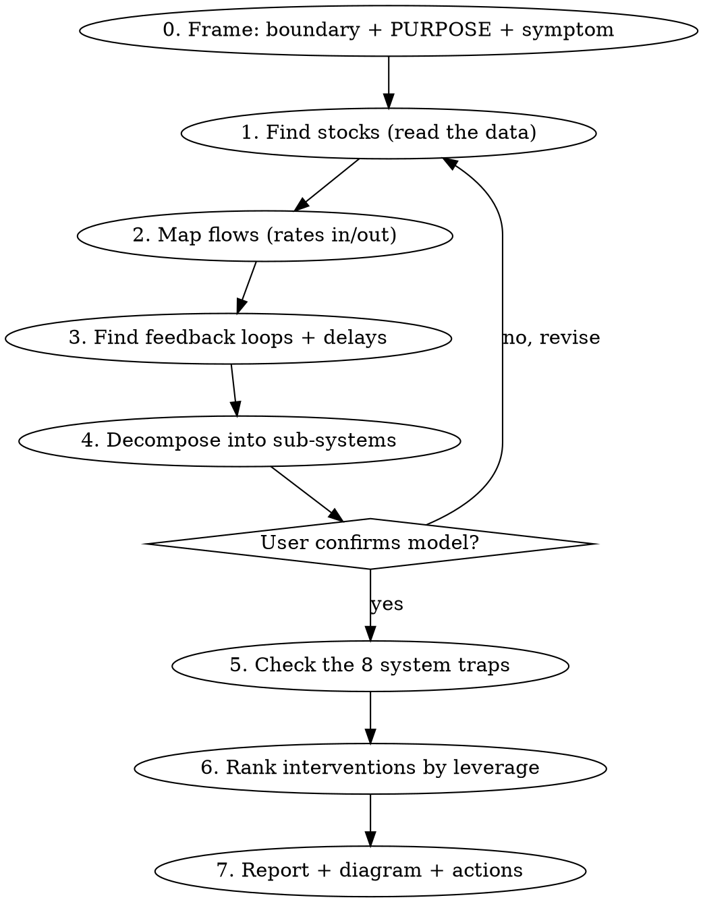

# Systems Thinking — Diagnose & Intervene

## Overview

A system is **not** a list of metrics. A system is a set of **elements**,
**interconnections**, and a **purpose** that produces its own behavior over
time. To optimize a growing system you must see its structure — the stocks
that accumulate, the flows that fill and drain them, and the feedback loops
that drive growth and impose limits — then intervene where leverage is
highest, not where it's most obvious.

**Core principle (Meadows):** *The least obvious interventions are usually the
most powerful.* People reliably push on low-leverage points (tweak a number, a
target, a budget) and often push them the wrong way. High leverage lives in
feedback structure, rules, goals, and paradigms.

This skill runs a **guided diagnostic**: you work *with* the user, one phase at
a time, building a shared model of their system before recommending anything.
Read actual data files when they exist — don't guess numbers you can measure.

## When to use

- "Help me optimize our onboarding / growth / retention / support system."
- A metric is stuck, eroding, oscillating, or growing uncontrollably.
- A fix keeps failing or makes things worse over time.
- You want a structural view + a prioritized, leverage-ranked action list.

**When NOT to use:** pure data analysis with no system to change; a one-off
calculation; a problem with no feedback, accumulation, or repeated behavior.

## The diagnostic workflow

Work through the phases **in order, one at a time**. After each phase, show the
user what you found and confirm before moving on. Do not jump to
recommendations before the model is built and agreed.

**Detailed, step-by-step how-to for Phases 0–4 (with a worked onboarding
example) is in `references/diagnostic-method.md` — read it when running a
diagnostic.** The summaries below are the at-a-glance version.

### Phase 0 — Frame the system

- Define the **boundary**: what's inside the system, what's an external input?
  Boundaries are chosen for the problem, not given. Too narrow misses the cause;
  too wide is unanalyzable.
- Name the **purpose/function** — *inferred from behavior, not stated intent*.
  "The least obvious part of a system, its function or purpose, is often the
  most crucial determinant of the system's behavior." A purpose deduced from
  what the system actually does often differs from the official goal. Surface
  that gap.
- Name the **symptom or goal** the user cares about (the behavior-over-time
  they want to change).

### Phase 1 — Find the stocks

Stocks are **accumulations** — what the system stores: the elements you could
count if everything stopped. *Stock = the present memory of the history of
changing flows.*

- Examples: accounts opened, active users, trial users, support tickets open,
  candidates in pipeline, cash, trust, reputation, skill.
- **Read the data.** If CSVs / dashboard exports / DB query results exist,
  open them and quantify each stock and its trend over time. Ask the user for
  data before estimating.
- A stock changes *slowly* — it can only change as fast as its flows. This is
  why systems have momentum and why quick fixes to stocks rarely hold.

### Phase 2 — Map the flows

For every stock, identify its **inflows** (fill it) and **outflows** (drain it),
and quantify the rates.

- Onboarding example: `signups → [Accounts Opened] → activated`; the outflow of
  "accounts opened" is the inflow to "activated users", whose outflow is churn.
- A stock rises only when total inflow > total outflow. To grow a stock you can
  raise inflow *or lower outflow* — people fixate on inflow and ignore the
  cheaper outflow lever (e.g. chasing signups while ignoring churn).
- Note where flows are measured vs. assumed.

### Phase 3 — Find the feedback loops (+ delays)

Loops are *why systems generate their own behavior*. Find both kinds:

- **Reinforcing loops (R)** — growth engines / vicious cycles. A stock feeds
  its own inflow: more users → more referrals → more users; more revenue →
  more ad spend → more revenue. These produce exponential growth or collapse.
- **Balancing loops (B)** — limits / goal-seeking / stabilizers. They push a
  stock toward a target or resist change: market saturation, support capacity,
  onboarding friction, budget caps. Every reinforcing loop eventually meets a
  balancing one — find the limit that will bite.
- **Delays** — time lags between action and effect (hiring ramp, word-of-mouth
  lag, perception delay). Delays cause overshoot and oscillation; a system that
  oscillates almost always has a delay in a balancing loop.

Ask: which loop currently dominates? Dominance shifts over time — that shift is
usually the story behind the metric.

### Phase 4 — Decompose into sub-systems (hierarchy & interconnections)

Systems are nested. Break the system into sub-systems, each with its own
stocks/flows/loops, and map how they connect.

- **Find interconnections** by tracing what each sub-system *sends to* and
  *receives from* the others — usually **information flows** or a physical
  stock handed off. The output of one sub-system is the input of the next.
- E.g. Growth system = [Acquisition] → [Onboarding] → [Activation] →
  [Retention], each handing a stock to the next; plus a [Support] sub-system
  whose backlog feeds back into churn.
- Watch the interfaces: most dysfunction lives in the *interconnections and the
  information flowing across them*, not inside a single box. Hierarchy exists to
  reduce information load — sub-systems should largely manage themselves and
  serve the whole. A sub-system optimizing its own goal at the expense of the
  whole (suboptimization) is a classic failure.

**Confirm the model with the user before continuing.**

### Phase 5 — Check the system traps

Test the system against the **8 archetypes**. Each is a structure that
predictably produces trouble, and each has a known way out. Read
`references/system-traps.md` and check each against the user's system:

policy resistance · tragedy of the commons · drift to low performance ·
escalation · success to the successful · shifting the burden (addiction/
dependence) · rule beating · seeking the wrong goal.

Name every trap that matches, with the specific evidence, and note its way out.

### Phase 6 — Find the leverage points

Map every candidate intervention onto Meadows' **12 leverage points** and rank
by effectiveness. Read `references/leverage-points.md`. Increasing power:

`12 numbers · 11 buffers · 10 stock/flow structure · 9 delays ·
8 balancing loops · 7 reinforcing loops · 6 information flows · 5 rules ·
4 self-organization · 3 goals · 2 paradigms · 1 transcending paradigms.`

- The bottom of the list (numbers/parameters) is where everyone intervenes and
  where the least changes. Push the user *up* the list.
- For each proposed action, label its leverage point #, say why, and flag
  low-leverage moves explicitly ("this is a #12 number-tweak — it won't change
  the behavior the structure produces").

### Phase 7 — Produce the deliverable

Write `./systems-analysis-<system>.md` in the current project **and** show it
inline. Three parts:

1. **Report** — boundary & purpose (official vs. actual), stocks (with data),
   flows & rates, feedback loops (R/B + delays), sub-systems &
   interconnections, dominant loop, traps detected.
2. **Diagram** — a Mermaid stock-and-flow + feedback-loop diagram. Use
   `references/diagram-templates.md`.
3. **Prioritized actions** — table sorted high-leverage first:

   | # | Intervention | Leverage point | Why / mechanism | Effort | Trap it addresses |

## Quick reference

| Concept | One-liner | Where to look in their system |
|---|---|---|
| Stock | An accumulation | What can you count? (users, tickets, cash) |
| Flow | Rate that fills/drains a stock | signups/wk, churn/wk |
| Reinforcing loop (R) | Growth/collapse engine | referrals, network effects |
| Balancing loop (B) | Limit / stabilizer | capacity, saturation, friction |
| Delay | Lag between cause & effect | ramp time, perception lag |
| Sub-system | Nested system w/ own behavior | acquisition vs. onboarding vs. support |
| Trap | Structure that breeds trouble | see system-traps.md |
| Leverage point | Where a change ripples | see leverage-points.md |

## Common mistakes

- **Treating dashboards as the system.** Metrics are stock *levels*; the system
  is the structure producing them. Always model flows and loops.
- **Optimizing inflow only.** Reducing an outflow (churn) is often higher
  leverage and cheaper than pumping inflow (signups).
- **Pushing low-leverage points, often backwards.** Tweaking a number feels
  productive and rarely changes behavior. Go up the leverage list.
- **Accepting the stated goal.** Infer the real goal from behavior; a system
  serving the wrong goal is a trap no parameter will fix.
- **Ignoring delays.** Oscillation and overshoot are delay symptoms, not
  "execution problems."
- **Recommending before the model is built and confirmed.** Run the phases.

## Guidelines for living in a world of systems (Meadows, Ch.7)

Apply throughout: 1) Get the beat of the system before intervening.
2) Expose mental models to the light of day. 3) Honor, respect, and distribute
information (most system trouble is bad/late/missing information).
4) Use language with care; enrich it with systems concepts. 5) Pay attention to
what is important, not just what is quantifiable. 6) Make feedback policies for
feedback systems. 7) Go for the good of the whole. 8) Listen to the wisdom of
the system. 9) Locate responsibility within the system. 10) Stay humble — stay
a learner. 11) Celebrate complexity. 12) Expand time horizons. 13) Defy the
disciplines. 14) Expand the boundary of caring. 15) Don't erode the goal of
goodness.
