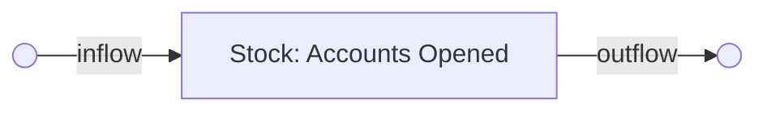
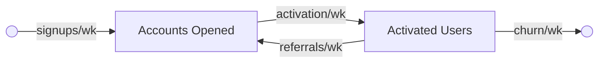
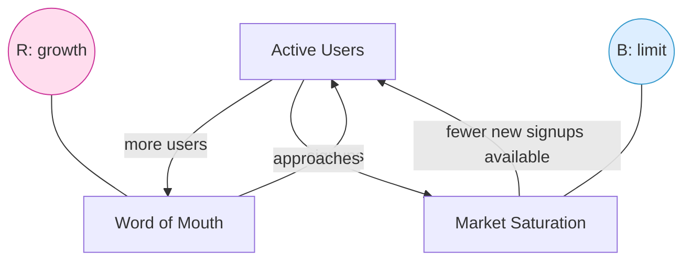
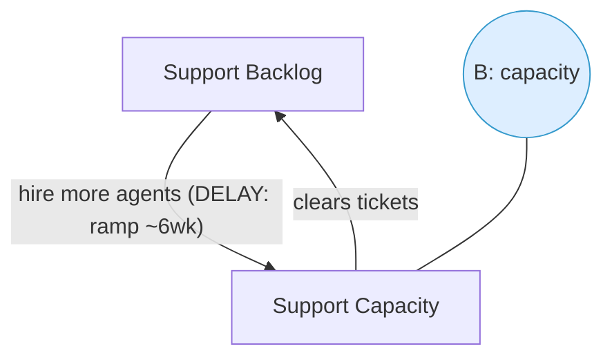
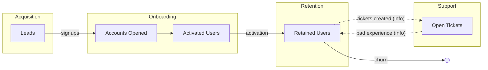

# Diagram Templates (Mermaid)

Conventions, following Meadows' stock-and-flow notation:

- **Stocks** = boxes (`[Name]`) — accumulations you can count.
- **Flows** = labeled arrows into/out of stocks (the "pipes").
- **Clouds** = sources/sinks outside the boundary (`(( ))` or a node named
  `Source`/`Sink`).
- **Reinforcing loop** = label the loop **R** (growth/runaway).
- **Balancing loop** = label the loop **B** (goal-seeking/stabilizing).
- Mark **delays** on the link that has the lag.

Mermaid can't draw true SDM pipes, so model stocks as nodes, flows as labeled
edges, and annotate loops with `R`/`B` nodes. Keep one diagram focused.

---

## 1. Stock-and-flow (single stock — the "bathtub")

## 2. Linked stocks — a funnel / chain of sub-systems

## 3. Reinforcing + balancing loops (growth meeting a limit)

## 4. Balancing loop with a delay (causes oscillation)

## 5. Sub-system map (hierarchy + interconnections)

Show sub-systems as subgraphs; edges across them are the **interconnections**
(usually a handed-off stock or an information flow).

---

### Tips
- **Line breaks in node labels use ` `, not `\n`** — Mermaid renders `\n`
  literally. Wrap multi-line labels in quotes: `(("B1: friction (dominant)"))`.
- Solid edge = physical/stock flow; dotted edge (`-.->`) = information flow.
- Put rates on flow labels when you have data (`signups/wk: 1,200`).
- Mark the **dominant loop** (e.g. bold or a note) — it's the headline finding.
- One diagram per question. Don't cram the whole company into one chart.
